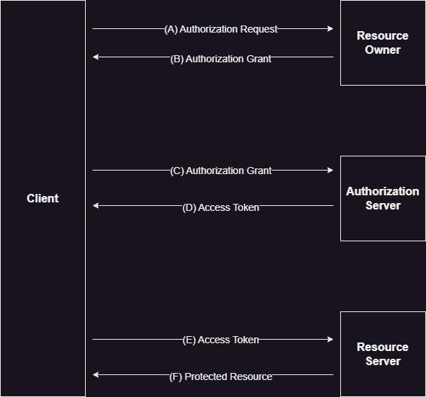

# OAuth

OAuth is an open-standard authorization protocol or framework that provides applications the ability for "secure designated access". OAuth doesn't share password data but instead uses authorization tokens to prove an identity between consumers and service providers. OAuth is an authorization protocol that allows you to approve one application with another on your behalf without giving away your password.

## OAuth 1.0

The OAuth protocol was stablized at version 1.0 in October 2007, and revised in June 2009 (Revision A) as published at https://oauth.net/core/1.0a/.

### Roles

**Service Provider**\
A web application that allows access via OAuth.

**User**\
An individual who has an account with the Serivce Provider

**Consumer**\
A website or application that uses OAuth to access the Service Provider on behalf of the User.

### Flow

#### (1) The Consumer obtains an unauthorized Request Token
The sole purpose of the Request Token is to receieve User approval and to obtain an Access Token.

To obtain a Request Token, the Consumer sends an HTTP request to the Service Provider's Request Token URL. The request must be ***signed*** and contains the following parameters:
- oauth_consumer_key
- oauth_signature_method
- oauth_signature
- oauth_timestamp
- oauth_nonce
- oauth_version

#### (2) The User authorizes the Request Token
The Consumer cannot use the Request Token until it has been authorized by the User. Obtaining User authorization includes the following steps.
- The Consumer directs the User to the Service Provider
- The Service Provider authenticates the User and obtains consent
- The Service Provider directs the User back to the Consumer

#### (3) The Consumer exchanges the Request Token for an Access Token.

#### (4) The Consumer accesses protected resources using the Access Token.

After successfully receiving the Access Token and Token Secret, the Consumer is able to access the Protected Resources on behalf of the User. The request MUST be signed and contains the following Parameters
- oauth_consumer_key
- oauth_token
- oauth_signature_method
- oauth_signaure
- oauth_timestamp
- oauth_nonce
- oauth_version

## OAuth 2.0
The OAuth 2.0 authorization framework enables a third-partiy application to obtain limited access to an HTTP service, either on behalf of a resource owener by orchestarting an approvall interaction between the resource owner and the HTTP service, oor by allowing the third-party application to obtain access on its own behalf. This specifiaction replaces and obsoletes the OAuth 1.0 protocol described in RFC 5849.

### Roles

**Resource Owner**\
An entity capable of granting access to a protected resource. When the resource owner is a persionm it is referred to as an end-user.

**Resource Server**\
The server hosting the protected resources, capable of accepting and responing to protected resource requests using access tokens.

**Client**\
Ap application making protected resource requests on behalf of the resource owner and with its authorization. The term "client" does not imply and particular implementation characteristics.

**Authorization Server**\
The serer issuing access tokens to the client after successfully authenticating the resource owner and obtaining authorization.

### Flow

- (A) The client requests authorization from the resource owner. The authroization request can be made directly to the resource owner, or preferably indirectly via the authorization server as an intermediary.

- (B) The client receives an authorization grant, which is a credential representing the resource owner's authorization, expressed using one of four grant types defined in this specifiation or using an extension grant type.

- (C) The client request an access token by authenticating with the authorization server and presenting the authorization grant.

- (D) The authorization server authenticates the client and validates the authorization grant, and if valid, issues an access token.

- (E) The client requests the protected resource from the resource server and authenticates by presenting the access token.

- (F) The resource server validates the access token, and if valid, serves the request.

### Authorization Grant

An authorization grant is a credential representing the resource owner's authorization used by the client to obtain an access token. There are four grant types -- authorization code, implicit, resource owner password credentials, and client credentials.

## Differences between Oauth 1.0 and OAuth 2.0

Followings are the major improvements that has happened in OAuth2.0

- Better support for non-browser applications 
- Reduced complexity in signing requests
- The separation of roles
- The short-ived access token and the refresh token.
